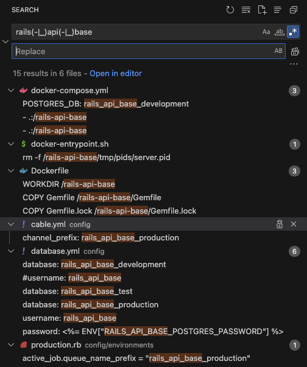
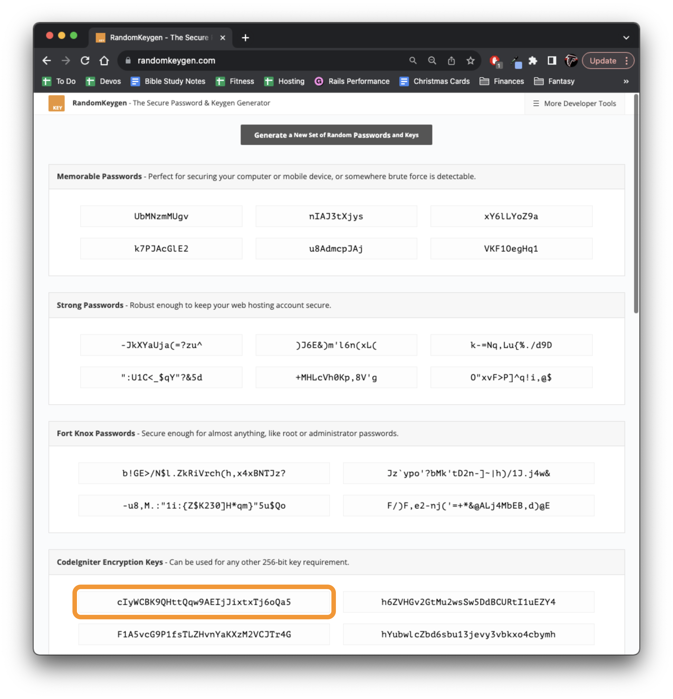
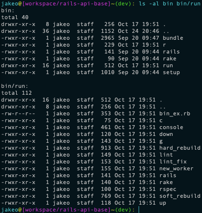

# Rails API Base

A starting point for building Rails APIs. 

When you quick start with `rails-api-base`, your API comes preconfigured for working with:

- `Docker`
- `Environment Variables`
- `bin/r CLI Scripts`
- `Postgres`
- `Sidekiq (plus Sidekiq Cron)`
- `JWT Authentication`
- `Policy Objects`
- `Service Objects`
- `Query Objects`
- `JSON::API Serializers`
- `Logging`
- `StandardRB Linting`
- `rspec`
- `ERDs`
- `rack-mini-profiler`
- `Github Test & Lint Actions`
- `Github PR Templates`

Requires some (very minimal) configuration beyond simply forking, which is covered below.

## Quick Start

1. [Import from this Repository](https://github.com/new/import)

    * You could also [fork](https://github.com/jakeod99/rails-api-base/fork) if you'd rather keep your project tied to any updates this one may receive.

1. Search for all instances of `rails-api-base` and `rails_api_base` in this codebase, and replace them with your project's name (following the same format).

    * Specifically, update the following:
    
    

1. Be sure you have the following installed locally:

    * [Docker Desktop](https://www.docker.com/products/docker-desktop/) (plus `docker` CLI commands)
    * [Rails](https://www.digitalocean.com/community/tutorials/how-to-install-ruby-on-rails-with-rbenv-on-macos) (in order to use `bundler` locally and copy the resulting `Gemfile` to docker)

1. Establish your local `secret_jwt_key`

    * Delete `credentials.yml.enc`
    * Navigate to [Random Keygen](https://randomkeygen.com/), and copy one of the randomly generated `CodeIgniter Encryption Keys`

    

    * Add it to your Rails credentials by running the following
        * `EDITOR="code --wait" rails credentials:edit`
        * In the the `.yml` that pops up, add the hash `secret_jwt_key: your-copied-encryption-key`

1. With the exception of `/bin/run/bin_ex.rb`, check to be sure all the files in `/bin` (including in `bin/run`) are executable.

    * Run `ls -al bin bin/run`

    

    * For any executables that do not have the necessary execute permissions, update to the level of permission you see fit (e.g., `chmod 755 bin/run/lint`)

1. Copy `.env.template` into a new local `.env`

1. Run `bin/r hard_rebuild`

    * Once all containers have spun up (`db`, `redis`, `api`, and `sidekiq`), your api should be discoverable at [port 3000](http://localhost:3000/)!

## Installation (TODO)
- [x]  Postgres

- [x]  JSON API Serializer

- [x]  JWT Auth

- [x]  Service Objects

- [x]  Logging

- [x]   .env

- [x]  rspec

- [x]  Postman

- [x]  Docker

- [x]  Sidekiq

- [x]  Sidekiq Cron

- [x]  standardRB linting

- [x]  bin execution options

- [x]  Encourage Use of https://dbdiagram.io/d for ERDs when Schema updates (import schema.rb)

- [x]  rack-mini-profiler (localhost:3000?pp=help)

- [x]  Github Test Actions

- [x]  Github Merge Expectations Checklist (rspec, erd, lint, postman)

- [x]  Policies (https://dev.to/kputra/rails-policy-objects-implementation-50ni)

- [x]  Query Objects (https://medium.com/selleo/essential-rubyonrails-patterns-part-2-query-objects-4b253f4f4539)